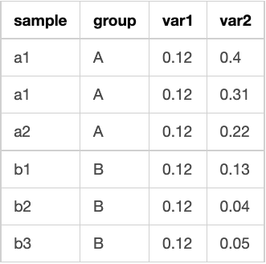
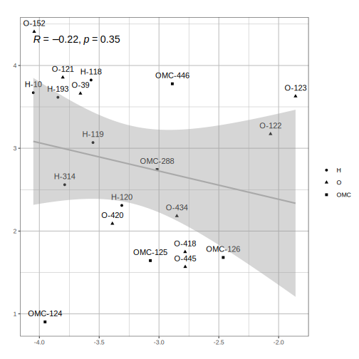

## Intructions

To use this Shiny app, you must upload a file with the following format separted by tabs:

Here is an example [table](https://github.com/LuiguiGallardo/shiny_correlation_lmgb/blob/main/example_table.tsv) (you can download it and test the application).

After, you can select the method for the correlation (Pearson or Spearman). In the 'Results table' tab, you will be able to observe all the significant correlations according to the p-value cutoff that you select.

Finally, in the 'Plots' tab, you can select the correlation of your interest to create an individual plot and download it in SVG format. This is an example of the output:

